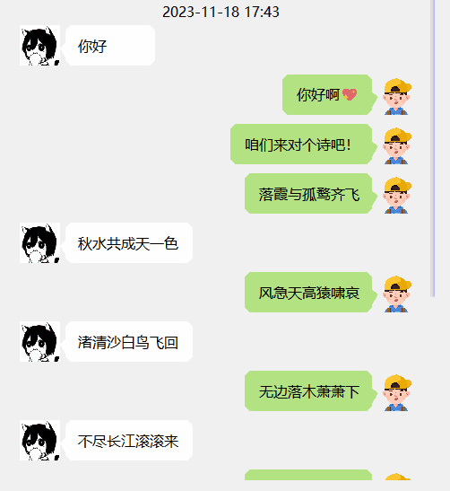
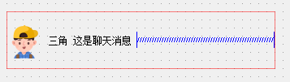
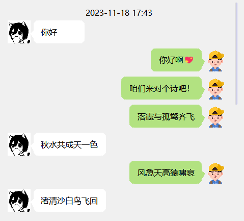
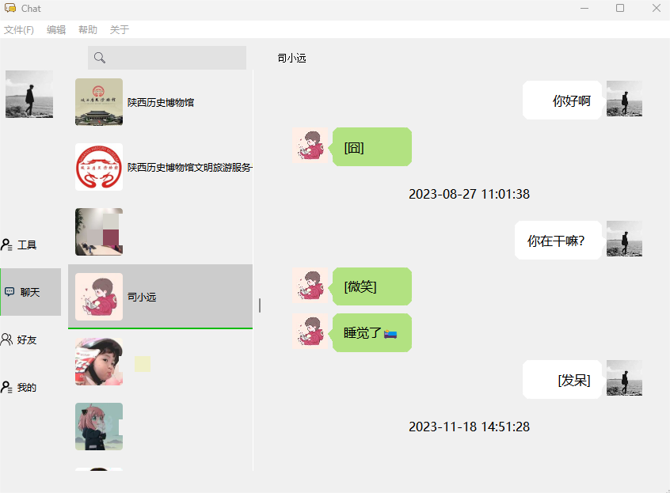

# Pyqt实现微信气泡消息

最近在做一个[微信数据库备份](https://github.com/LC044/WeChatMsg)的项目，想做个界面展示聊天记录，奈何一直没有找到用pyqt实现的类似微信的聊天界面，于是就想着自己做一个。

## 特性

1. 自适应大小、支持缩放: 通过重写QLabel并添加合适的布局，实现消息框的自适应大小，并支持缩放。
2. 支持图片显示: 项目支持在聊天框中显示图片消息，为用户提供更加丰富的聊天体验。
3. 支持更换头像: 用户可以轻松更换头像，个性化定制聊天界面。

效果



## 实现原理，重写QLabel，添加布局

### 聊天框布局
聊天框由四部分组成：最左侧是头像，右侧是聊天内容，中间绘制一个三角形指向头像，最右侧放置一个弹簧控件来调整消息的长度。



### 头像的实现
头像通过继承QLabel实现，用户可以传入头像路径或QPixmap对象。头像会根据需要进行缩放，并设置固定的大小。

```python
class Avatar(QLabel):
    def __init__(self, avatar, parent=None):
        super().__init__(parent)
        if isinstance(avatar, str):
            self.setPixmap(QPixmap(avatar).scaled(45, 45))
            self.image_path = avatar
        elif isinstance(avatar, QPixmap):
            self.setPixmap(avatar.scaled(45, 45))
        self.setFixedSize(QSize(45, 45))
```
### 绘制三角形
通过继承QLabel实现一个三角形，用于指向头像的方向。根据消息是发送还是接收，绘制不同方向的三角形。

```python
class Triangle(QLabel):
    def __init__(self, Type, is_send=False, parent=None):
        super().__init__(parent)
        self.Type = Type
        self.is_send = is_send
        self.setFixedSize(6, 45)

    def paintEvent(self, a0: QtGui.QPaintEvent) -> None:
        super(Triangle, self).paintEvent(a0)
        if self.Type == MessageType.Text:
            painter = QPainter(self)
            triangle = QPolygon()
            if self.is_send:
                painter.setPen(QColor('#b2e281'))
                painter.setBrush(QColor('#b2e281'))
                triangle.setPoints(0, 20, 0, 35, 6, 27)
            else:
                painter.setPen(QColor('white'))
                painter.setBrush(QColor('white'))
                triangle.setPoints(0, 27, 6, 20, 6, 35)
            painter.drawPolygon(triangle)
```

### 文字消息控件
通过继承QLabel实现文字消息控件，支持自动换行、文字选择和不同样式的边框。

```python
class TextMessage(QLabel):
    heightSingal = pyqtSignal(int)

    def __init__(self, text, is_send=False, parent=None):
        super(TextMessage, self).__init__(text, parent)
        font = QFont('微软雅黑', 12)
        self.setFont(font)
        self.setWordWrap(True)
        self.setMaximumWidth(800)
        self.setMinimumWidth(100)
        self.setMinimumHeight(45)
        self.setTextInteractionFlags(Qt.TextSelectableByMouse)
        self.setSizePolicy(QSizePolicy.Ignored, QSizePolicy.Ignored)
        if is_send:
            self.setAlignment(Qt.AlignCenter | Qt.AlignRight)
            self.setStyleSheet(
                '''
                background-color:#b2e281;
                border-radius:10px;
                padding:10px;
                '''
            )
        else:
            self.setStyleSheet(
                '''
                background-color:white;
                border-radius:10px;
                padding:10px;
                '''
            )
        font_metrics = QFontMetrics(font)
        rect = font_metrics.boundingRect(text)
        self.setMaximumWidth(rect.width()+30)
```

核心是边框样式的设置，self.setWordWrap(True)设置文字自动换行，self.setTextInteractionFlags(Qt.TextSelectableByMouse)设置文字可选中，self.setAlignment(Qt.AlignCenter | Qt.AlignRight)设置文字对齐方式

```css
{
   background-color:#b2e281;
   border-radius:10px;
   padding:10px;
}
```

### 聊天框组件

最后，将头像、三角形和消息控件组合在一起，通过水平布局排列，形成完整的聊天框组件。

```python
class BubbleMessage(QWidget):
    def __init__(self, str_content, avatar, Type, is_send=False, parent=None):
        super().__init__(parent)
        self.isSend = is_send
        # self.set
        self.setStyleSheet(
            '''
            border:none;
            '''
        )
        layout = QHBoxLayout()
        layout.setSpacing(0)
        layout.setContentsMargins(0, 5, 5, 5)
        # self.resize(QSize(200, 50))
        self.avatar = Avatar(avatar)
        triangle = Triangle(Type, is_send)
        if Type == MessageType.Text:
            self.message = TextMessage(str_content, is_send)
            # self.message.setMaximumWidth(int(self.width() * 0.6))
        elif Type == MessageType.Image:
            self.message = ImageMessage(str_content)
        else:
            raise ValueError("未知的消息类型")

        self.spacerItem = QSpacerItem(45 + 6, 45, QSizePolicy.Expanding, QSizePolicy.Minimum)
        if is_send:
            layout.addItem(self.spacerItem)
            layout.addWidget(self.message, 1)
            layout.addWidget(triangle, 0, Qt.AlignTop | Qt.AlignLeft)
            layout.addWidget(self.avatar, 0, Qt.AlignTop | Qt.AlignLeft)
        else:
            layout.addWidget(self.avatar, 0, Qt.AlignTop | Qt.AlignRight)
            layout.addWidget(triangle, 0, Qt.AlignTop | Qt.AlignRight)
            layout.addWidget(self.message, 1)
            layout.addItem(self.spacerItem)
        self.setLayout(layout)
```

## 最终效果



应用到项目中去:[微信聊天记录备份](https://github.com/LC044/WeChatMsg)



# 开源地址

[https://github.com/LC044/pyqt_component_library](https://github.com/LC044/pyqt_component_library)